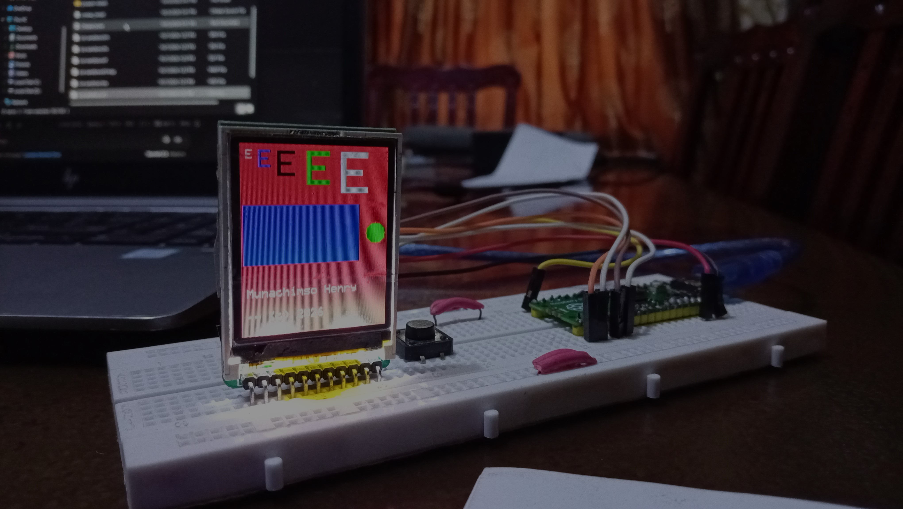

# LCD Driver for the ST7735 Chip for the Raspberry Pi Pico
 
A small, readable, bare-metal C driver for **ST7735 (128x160) SPI TFT displays** on the **Raspberry Pi Pico (RP2040)**, written directly against the Pico SDK. Drawing runs at **80-91% of what the SPI bus can physically deliver**, and every claim in this README comes with a measurement and a method.
 
 
 
## Why this exists
 
I wanted to understand how the display I had really worked, down from the SPI wires all the way up to the text on the screen. It started as an exercise to build my C proficiency but actually grew all the way up to this. 

I wrote the driver with no display library underneath it. Once that, I treated it as an engineering problem: measure it, find the bottleneck, fix it, and measure again.
 
It is meant as a compact reference driver you can read in one sitting, not as a replacement for a full graphics stack like LVGL or Adafruit GFX lol.
 
## Highlights
 
- Hardware SPI0, the datasheet reset and init sequence, RGB565 colour
- Full printable ASCII (32-126) in a 5x7 font, integer scaling 1-6, automatic line wrapping and `\n`
- Pixels, rectangles (clipped), filled circles, characters and strings
- Shapes and text run at **80-91%** of the SPI bus's theoretical throughput
- A 30x30 rectangle went from **22.1 ms to 2.07 ms (10.7x)** compared with my first working version
- Efficiency holds at **89-91% from 7.8 to 31.25 MHz** with a clean picture on my module (full-screen fill clock sweep; at 62.5 MHz the display output broke)
- Depends only on the Pico SDK
## Hardware
 
Tested with my 1.8 inch 128x160 ST7735 SPI module 
 
| Display pin | Pico GPIO |
|---|---|
| SCK | GP18 (SPI0 SCK) |
| MOSI / SDA | GP19 (SPI0 TX) |
| CS | GP15 |
| DC / A0 | GP17 |
| RES | GP16 |

 
CS, DC and RES can be changed in `src/st7735.h` (`PIN_CS`, `PIN_DC`, `PIN_RES`). SCK and MOSI use SPI0's GP18 and GP19.
 
## Quick start
 
Requirements: the [Pico SDK](https://github.com/raspberrypi/pico-sdk) tested with: Pico SDK Version: 2.2.0 (Stable) and CMake.
 
```
export PICO_SDK_PATH=/path/to/pico-sdk
mkdir build && cd build
cmake ..
make
```
 
Hold BOOTSEL while plugging in the Pico, then copy a generated `.uf2` file (for example `examples/demo/demo.uf2`) to the drive that appears.
 
```c
#include "pico/stdlib.h"
#include "st7735.h"
 
int main(void) {
    st7735_init();
    st7735_fill_screen(COLOR_BLACK);
 
    draw_string(4, 4, "Hello Pico", COLOR_WHITE, COLOR_BLACK, 2);
    draw_rect(10, 40, 60, 30, COLOR_BLUE);
    draw_filled_circle(100, 60, 12, COLOR_GREEN);
 
    while (1) tight_loop_contents();
}
```
 
## API
 
| Function | What it does |
|---|---|
| `st7735_init()` | Configures SPI0 and the control pins, resets the display, runs the startup sequence (default clock 8 MHz requested) |
| `st7735_set_baudrate(hz)` | Changes the SPI clock at runtime and returns the rate actually achieved |
| `st7735_fill_screen(color)` | Fills the whole screen |
| `draw_pixel(x, y, color)` | Draws one pixel |
| `draw_rect(x, y, w, h, color)` | Filled rectangle, clipped to the screen |
| `draw_filled_circle(cx, cy, r, color)` | Filled circle, clipped to the screen. Built on `draw_pixel`, so it is not part of the optimized paths measured below |
| `draw_char(x, y, c, fg, bg)` | One character, 5x7 |
| `draw_char_scaled(x, y, c, fg, bg, scale)` | One character at scale 1-6 (skipped if it would not fit) |
| `draw_string(x, y, str, fg, bg, scale)` | Text with wrapping at the right edge and `\n`; stops at the bottom of the screen |
 
Colours are 16-bit RGB565. `COLOR_BLACK`, `COLOR_WHITE`, `COLOR_RED`, `COLOR_GREEN` and `COLOR_BLUE` are predefined. Characters outside ASCII 32-126 are drawn as `?`.
 
## Performance
 
### Method
 
- SPI ran at **7.8125 MHz** (8 MHz requested; the RP2040's divider rounds down; the actual rate is read back with `spi_get_baudrate`).
- Times come from the RP2040's `time_us_64()` timer, averaged over 20 runs (5 for full-screen fills). Run-to-run differences are about 10 us.
- **Ideal time** is the wire-only minimum: `(11 + 2 x pixels) x 8 bits / baud`. Each pixel is 2 bytes (RGB565), and the 11 bytes are the address window (3 command bytes and 8 parameter bytes).
- **Efficiency** is `ideal / measured`: the share of time the bus is actually carrying useful data.
- All timings were taken on the device itself. No external instrument (logic analyzer or oscilloscope) was used to verify bus timing.
### Results at 7.8125 MHz
 
| Operation | Pixels | First version | Now | Speedup | Ideal | Efficiency (first -> now) |
|---|---|---|---|---|---|---|
| `fill_screen` | 20,480 | 74,413 us | 46,092 us | 1.6x | 41,954 us | 56% -> 91% |
| `draw_char` (5x7) | 35 | 865 us | 104 us | 8.3x | 83 us | 10% -> 80% |
| `draw_char_scaled` (x3) | 315 | 7,764 us | 749 us | 10.4x | 656 us | 8% -> 88% |
| `draw_rect` (30x30) | 900 | 22,108 us | 2,072 us | 10.7x | 1,855 us | 8% -> 90% |
| `draw_string` (21 chars) | 882 | 18,157 us* | 2,147 us | 8.5x | 1,818 us | 10% -> 85% |
 
\* The first-version string time is 21 calls of the original `draw_char` (735 pixels; the one-pixel gaps between characters are not painted), while `draw_string` paints all 882 pixels. Against a loop of today's `draw_char` (2,118 us, 735 pixels) it takes about the same time, 2,147 us, but it also paints the gaps and handles wrapping. I expected it to be faster than that loop, and it is not.
 
"First version" is the straightforward implementation I wrote first when I started out on this driver project: every pixel set its own address window, and bytes were sent one SPI call at a time. Its source is kept in the development history: see [sandbox](https://github.com/Draycole/lcd-sandbox) .
 
### Clock sweep (full-screen fill)
 
| Actual SPI clock | Fill time | Ideal | Efficiency | Overhead per 16-bit frame |
|---|---|---|---|---|
| 7.81 MHz | 46,101 us | 41,954 us | 91.0% | 0.20 us (1.6 clock periods) |
| 15.63 MHz | 23,156 us | 20,977 us | 90.6% | 0.11 us (1.7 periods) |
| 20.83 MHz | 17,425 us | 15,733 us | 90.3% | 0.08 us (1.7 periods) |
| 31.25 MHz | 11,689 us | 10,489 us | 89.7% | 0.06 us (1.8 periods) |
| 62.50 MHz* | 5,908 us | 5,244 us | 88.8% | 0.03 us (2.0 periods) |
 
Timing alone does not show that the display accepted the data. On my module the picture was clean up to 31.25 MHz and broke when I went higher.
 
\* At 62.5 MHz the SPI bus kept running at about the same efficiency, but the display output broke (bright and garbled), so that row describes the bus, not a working display. The default clock stays at 8 MHz. Faster clocks worked on my module, but check your display's datasheet before relying on them. The max speed of mine was 15MHz (from 1 / 66 ns minimum serial clock write cycle ).
 
## How it got from ~8% to ~90%
 
### 1. Finding the bottleneck
 
The first version worked, but felt slow (I had a feeling it was grossly unoptimized), so I measured it. At 7.8125 MHz the bus can move 1.02 us per byte, so a full 128x160 fill (40,960 bytes) cannot take less than about 42 ms. My first version took 74 ms. A 30x30 rectangle, with only 1,800 bytes of colour, took 22 ms where the wire needed under 2 ms.
 
The cause was visible in the byte counts. To place one pixel, the ST7735 needs an address window: a column command, four column bytes, a row command, four row bytes and a memory-write command. That is 11 bytes of addressing for 2 bytes of colour. My first `draw_pixel` did that for every pixel, and every byte was its own SPI call.
 
For the 30x30 rectangle that meant:
 
- **11,700 bytes sent**, of which only 1,800 were pixel data (**15% useful**)
- even those 11,700 bytes needed 11,981 us at wire speed, but took 22,108 us (**54% efficient**)
- 15% x 54% is about 8%, which matches the measured efficiency
Two separate problems, multiplying: too many useless bytes, and too much overhead per byte sent.
 
### 2. One window, then stream the pixels
 
The ST7735 advances its write position automatically inside the window you set. So instead of re-aiming for every pixel, the driver sets the window **once per shape** and streams all the pixels after it. For the rectangle, that brought 11,700 bytes down to 1,811. For characters, which have different colours per pixel, the glyph is first assembled in a small RAM buffer and then sent in one burst. `draw_string` goes further: it sets one window for the whole line and sends it one pixel row at a time, so a 21-character line costs one window setup instead of 21, and vertical scaling is free because a row is built once and sent several times.
 
### 3. 16-bit SPI frames
 
RGB565 pixels are 16 bits, so the SPI peripheral is switched to 16-bit frames while pixels are streamed (and back to 8-bit for commands). A 16-bit frame leaves the wire high byte first, the same order the display expects, so this halves the number of frames the hardware has to handle. This took the full-screen fill from 50.0 ms (row-batched, 8-bit frames) to 46.1 ms.
 
### 4. Batching the window parameters (really small gain)
 
The window's column and row bytes were sent as eight separate one-byte transactions. Sending them as two 4-byte bursts removed six transactions, but the same 11 bytes still have to cross the wire. Measured saving: about 3 us per window. I kept it because it was funny to notice and simple, but it's a small win and I report it as one.
 
### 5. What is left
 
After these steps, shapes and text sit at 80-91% efficiency. The remaining time is not random: across the clock sweep, the overhead per 16-bit frame stays at roughly 1.6-2 SPI clock periods, and a straight-line fit gives about 1.5 clock periods plus a few nanoseconds. If the leftover were CPU time between FIFO writes it would stay constant in microseconds as the clock rises; instead it shrinks with the clock. That is consistent with the SPI peripheral inserting a short gap between frames. I have not been able to confirm this with an instrument, so it remains a hypothesis. It also suggests that DMA would not close the gap, which would be a good experiment.
 
`draw_string` lands a little lower (85%) than rectangles (90%). My hypothesis is that the extra time is the CPU building each pixel row before it is sent, which is not overlapped with the transfer. A double-buffered DMA version would be the way to test that.
 
## What this does not do (yet) :(
 
- `draw_pixel` and `draw_filled_circle` go through the single-pixel path (about 22-25 us per pixel at 7.8 MHz) and are not covered by the efficiency numbers above
- Fixed 128x160 size and a single orientation
- One font (5x7), no word-wrapping
- No DMA
- Tested on one module; the display's maximum reliable clock depends on the module and wiring
- Bus timing was measured on-chip only
## Repository layout
 
```
pico-st7735/
├── README.md
├── LICENSE
├── CMakeLists.txt
├── pico_sdk_import.cmake       
├── .gitignore                  
├── src/
│   ├── st7735.c
│   ├── st7735.h
│   ├── font5x7.c
│   └── font5x7.h
├── examples/
│   ├── demo/
|   |   ├── main.c
│   |   └── CMakeLists.txt
│   └── benchmark/ 
|       ├── main.c
│       └── CMakeLists.txt   
└── docs/
    ├── RESULTS.md              (raw serial printouts, dated)
    └── images/                 demo.jpg, setup.jpg, font.jpg
```
 
## License
 
MIT. See [LICENSE](LICENSE).